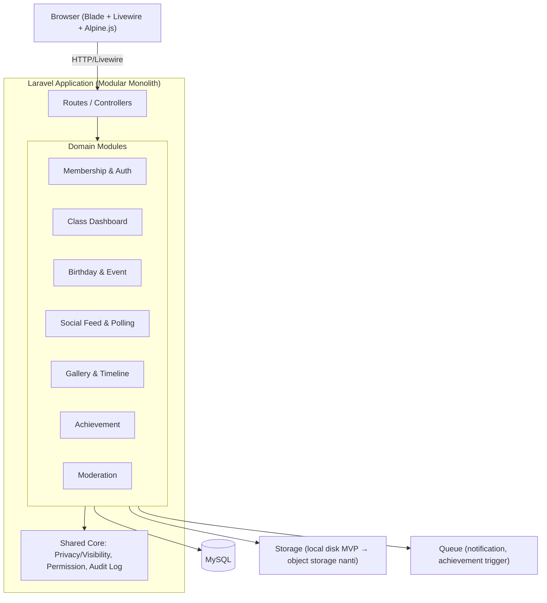

# 02 — Architecture

Status: ✅ Keputusan stack & arsitektur final.

## 1. Technical Stack Evaluation

Dievaluasi berdasarkan: learning curve, development speed, maintainability, scalability, ecosystem, team skill (tim mahasiswa), deployment, collaboration.

### Backend: Laravel

Tidak dievaluasi terhadap alternatif lain (Express, Django, dsb.) karena sudah ditetapkan sejak awal sebagai kandidat tunggal. Laravel cocok untuk profil tim ini:

| Kriteria | Catatan |
|---|---|
| Learning curve | Sedang — dokumentasi resmi Laravel termasuk yang terbaik di ekosistem web, komunitas Indonesia besar |
| Dev speed | Tinggi — Eloquent ORM, migration, artisan CLI, banyak boilerplate sudah disediakan |
| Maintainability | Tinggi — struktur MVC konvensional, mudah diikuti kontributor baru yang bergantian tiap semester |
| Scalability | Cukup untuk modular monolith skala kelas–angkatan; sudah terbukti di banyak SaaS skala menengah |
| Ecosystem | Sangat lengkap: auth (Breeze/Fortify), queue, notification, storage abstraction — semua kebutuhan MVP sudah ada package resminya |
| Deployment | Mudah — banyak panduan, kompatibel dengan shared hosting sampai VPS |

**Keputusan: Laravel (versi LTS terbaru).**

### Database: MySQL vs PostgreSQL

| Kriteria | MySQL | PostgreSQL |
|---|---|---|
| Learning curve | Lebih rendah, lebih umum diajarkan di kampus | Sedikit lebih tinggi |
| Fitur data sensitif (JSON, row-level constraint) | Cukup, tapi lebih terbatas | Lebih kuat (native JSONB, constraint lebih ekspresif) — relevan untuk model privacy per-field |
| Hosting gratis/murah | Sangat luas tersedia | Tersedia luas juga (Railway, Supabase, Neon, dll.) |
| Kompatibilitas Laravel | Native, paling umum dipakai tutorial Laravel | Native, didukung penuh |

**Keputusan: MySQL** untuk MVP — alasan utama adalah familiaritas tim mahasiswa dan ketersediaan hosting murah/gratis yang lebih luas, bukan karena keunggulan teknis mutlak. PostgreSQL tetap opsi valid untuk migrasi jika kebutuhan privacy-model jadi jauh lebih kompleks di fase multi-tenant lanjutan.

### Frontend: React vs Vue vs Flutter Web vs Blade + Livewire

| Kriteria | React | Vue | Flutter Web | Blade + Livewire |
|---|---|---|---|---|
| Learning curve | Sedang-Tinggi (JS ecosystem, state management) | Sedang | Tinggi (Dart, paradigma berbeda dari web biasa) | Rendah (tetap di PHP/Blade, minim JS) |
| Dev speed (tim kecil, 1 stack) | Lambat — butuh API terpisah + auth token flow + state sync | Lebih cepat dari React tapi tetap perlu API layer | Lambat, overkill untuk web-first product | **Cepat** — reaktivitas tanpa membangun REST API terpisah |
| Maintainability (tim bergantian tiap semester) | Butuh dua codebase (backend+frontend) dipahami sekaligus | Sama seperti React, sedikit lebih ringan | Butuh keahlian Dart yang jarang dimiliki tim mahasiswa Laravel | Satu bahasa (PHP), satu mental model — lebih mudah diwariskan ke tim berikutnya |
| Ecosystem untuk fitur produk ini | Sangat lengkap (chart, dsb.) | Lengkap | Terbatas untuk web | Cukup — Alpine.js melengkapi interaktivitas kecil (dropdown, modal, dsb.) |
| Real-time/reactive (feed, dashboard, notification) | Butuh setup tambahan (websocket/polling) | Sama | Sama | Livewire + Laravel Echo/Reverb menangani ini secara native dalam satu stack |
| Kesesuaian dengan "Simple First" & "Modular Monolith" | Menambah kompleksitas (API boundary, CORS, versioning) | Sama | Sama | Selaras — tidak ada boundary API/frontend terpisah untuk dijaga |

**Keputusan: Blade + Livewire (+ Alpine.js untuk interaktivitas kecil, + Tailwind CSS untuk styling).**

Alasan utama: tim mahasiswa dengan skill utama PHP/Laravel akan jauh lebih produktif tanpa harus memelihara dua codebase (backend API + SPA frontend) sekaligus dua sistem auth (session vs token). Livewire memberi reaktivitas yang cukup untuk kebutuhan produk ini (feed, polling real-time, dashboard dinamis) tanpa melanggar prinsip *Simple First*.

**Trade-off yang disadari:** jika di masa depan produk butuh native mobile app (bukan sekadar web responsive) atau tim frontend spesialis JS bergabung, migrasi ke arsitektur API + SPA/mobile client tetap dimungkinkan karena backend tetap terstruktur sebagai service layer yang bisa diekspos lewat API (lihat §3).

## 2. Final Stack Summary

| Layer | Pilihan |
|---|---|
| Backend framework | Laravel (LTS) |
| Frontend | Blade + Livewire + Alpine.js + Tailwind CSS |
| Database | MySQL |
| Auth | Laravel Breeze/Fortify (session-based) — detail di [`05-authentication.md`](./05-authentication.md) |
| Storage | Abstraksi Laravel Filesystem — driver disesuaikan environment, lihat [`11-storage.md`](./11-storage.md) |
| Queue/Notification | Laravel Queue (database driver di MVP, bisa upgrade ke Redis nanti) |

## 3. Architecture Pattern: Modular Monolith

Microservices dihindari — sesuai prinsip *Simple First* dan skala tim (mahasiswa, bukan tim enterprise). Satu aplikasi Laravel, tapi kode diorganisasi per **domain module** (bukan flat MVC semua campur), agar tetap mudah dipecah di masa depan jika benar-benar diperlukan.

### Prinsip Modul

- Setiap domain module (Membership, Dashboard, Birthday, Feed, Gallery, Achievement, Moderation) punya folder sendiri berisi model, controller/Livewire component, dan service class-nya — tidak saling mencampur logic.
- **Core** (Privacy/Visibility, Permission, Audit Log) adalah lapisan yang dipakai bersama semua module — ini adalah implementasi teknis dari fondasi P0 di [`product/05-privacy-and-moderation.md`](../product/05-privacy-and-moderation.md) dan [`product/04-roles-and-permissions.md`](../product/04-roles-and-permissions.md).
- Semua query di setiap module **wajib** di-scope `class_id` di level model/query, bukan diingat manual per-controller — detail mekanismenya diputuskan di [`03-database.md`](./03-database.md).

### External Services (opsional, ditambahkan hanya jika perlu)

Storage, Email, Notification channel eksternal, AI — **tidak** diaktifkan sejak MVP. Semua punya fallback lokal/in-app dulu (lihat [`product/06-mvp-scope-and-roadmap.md`](../product/06-mvp-scope-and-roadmap.md) prinsip *Build for One*). Ditambahkan satu per satu saat benar-benar dibutuhkan, bukan disiapkan di awal.

## 4. Dampak ke Dokumen Lain

Dengan stack ini ditetapkan, dokumen berikut sudah bisa mulai dikerjakan:

- [`03-database.md`](./03-database.md) — skema MySQL + konvensi Eloquent
- [`05-authentication.md`](./05-authentication.md) — Laravel Breeze/Fortify session-based
- [`14-git-workflow.md`](./14-git-workflow.md) dan [`17-team-contribution.md`](./17-team-contribution.md) — sudah bisa dikerjakan independen dari stack, prioritaskan berikutnya

`04-api.md` tetap relevan meski frontend berbasis Livewire (bukan SPA) — untuk kebutuhan future seperti mobile app atau integrasi kampus, sehingga backend perlu tetap didesain agar service layer-nya bisa diekspos sebagai API tanpa refactor besar.
