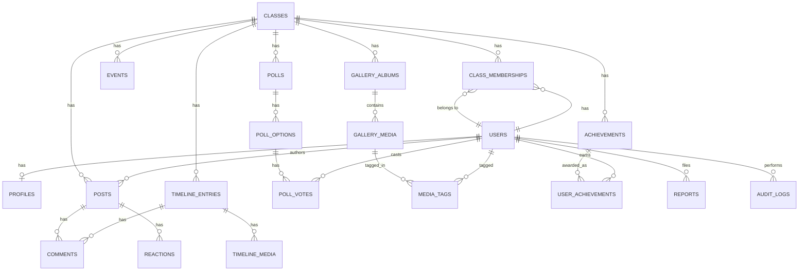

# 03 — Database Design

Status: ✅ Skema MVP final (mencakup fitur P0). Engine: MySQL, ORM: Eloquent (Laravel).

## Konvensi Global

Berlaku untuk **semua** tabel, wajib diikuti sejak migration pertama:

1. **`class_id` scoping** — setiap tabel yang menyimpan data milik satu kelas wajib punya kolom `class_id` (foreign key ke `classes`), dan setiap query wajib melalui [global scope Eloquent](https://laravel.com/docs/eloquent#global-scopes) `ForClassScope`, bukan diingat manual per-controller. Ini implementasi teknis dari prinsip *Design for Scale, Build for One*.
2. **Primary key** — `id` bigint auto-increment (bukan UUID di MVP; UUID dipertimbangkan lagi jika sinkronisasi multi-kampus benar-benar terjadi).
3. **Timestamps** — `created_at`, `updated_at` standar Eloquent di semua tabel.
4. **Soft delete** — dipakai di tabel yang datanya termasuk *Memory Forever* (posts, gallery_media, timeline_entries, comments) — dihapus tidak langsung hilang permanen, ada jeda untuk pemulihan/audit.
5. **Visibility enum** — dipakai berulang di banyak tabel: `public | class_only | admin_only | private`. Didefinisikan sekali sebagai Enum PHP (`App\Enums\Visibility`), dipakai lintas tabel. Implementasi teknis dari [`product/05-privacy-and-moderation.md`](../product/05-privacy-and-moderation.md).
6. **Polymorphic tables** untuk fitur yang dipakai lintas jenis konten (reaction, comment, report) — menghindari duplikasi tabel `post_likes`, `gallery_likes`, `timeline_likes` terpisah.

## Entity Relationship Diagram

*(Diagram disederhanakan untuk keterbacaan — kolom lengkap tiap tabel ada di bawah.)*

## Tabel Fondasi

### `users`
Identitas login, lintas kelas (satu user bisa jadi member di banyak kelas di masa depan).

| Kolom | Tipe | Catatan |
|---|---|---|
| id | bigint PK | |
| name | string | |
| email | string, unique | |
| password | string | hashed |
| email_verified_at | timestamp, nullable | |

### `classes`
Representasi satu kelas. Level `Faculty`/`Department`/`Campus` di atasnya **tidak dibuat di MVP** — cukup kolom `name` deskriptif (mis. "TI-6A 2024") sampai benar-benar dibutuhkan hierarki penuh (lihat [`product/06-mvp-scope-and-roadmap.md`](../product/06-mvp-scope-and-roadmap.md)).

| Kolom | Tipe | Catatan |
|---|---|---|
| id | bigint PK | |
| name | string | mis. "TI-6A" |
| graduation_target_date | date, nullable | untuk countdown wisuda di dashboard |

### `class_memberships`
Jantung dari sistem role & multi-tenancy. **Role dan status disimpan di sini, bukan di tabel `users`** — karena satu user bisa punya role berbeda di kelas berbeda di masa depan, dan status berubah dari waktu ke waktu (implementasi teknis dari catatan di [`product/04-roles-and-permissions.md`](../product/04-roles-and-permissions.md)).

| Kolom | Tipe | Catatan |
|---|---|---|
| id | bigint PK | |
| user_id | FK → users | |
| class_id | FK → classes | |
| role | enum | `super_admin, class_admin, moderator, member` (Guest tidak butuh baris — direpresentasikan sebagai "tidak login") |
| status | enum | `active, alumni, inactive` |
| joined_at | timestamp | |

Unique constraint: (`user_id`, `class_id`).

### `profiles`
Satu-ke-satu dengan `users`, tapi field bio/hobi/dsb. bersifat casual per prinsip *Member Profile bukan CV* ([`product/`](../product/03-target-user-analysis.md)).

| Kolom | Tipe | Catatan |
|---|---|---|
| id | bigint PK | |
| user_id | FK → users, unique | |
| nickname | string, nullable | |
| avatar_path | string, nullable | |
| bio | text, nullable | |
| hobby | json, nullable | array string |
| favorite | json, nullable | array string |
| fun_fact | text, nullable | |
| birth_date | date, nullable | |
| birth_year_visible | boolean, default false | tahun lahir opsional & tidak dipaksa, sesuai `product/02-...` §7.2 |
| birthday_visibility | enum (Visibility) | default `class_only` |
| profile_visibility | enum (Visibility) | default `class_only` |

## Tabel Fitur

### `events` (Event Countdown)
| Kolom | Tipe | Catatan |
|---|---|---|
| id, class_id | | |
| title, description | string, text | |
| starts_at | datetime | disimpan dalam UTC, dikonversi timezone di layer presentasi |
| location | string, nullable | |
| image_path | string, nullable | |
| organizer_id | FK → users, nullable | |
| status | enum | `upcoming, ongoing, completed, cancelled` |
| visibility | enum (Visibility) | |

### `posts` (Social Feed)
| Kolom | Tipe | Catatan |
|---|---|---|
| id, class_id | | |
| author_id | FK → users | |
| type | enum | `text, image, announcement, memory` — event/poll/achievement muncul di feed via reference, bukan duplikasi row |
| body | text, nullable | |
| media_path | string, nullable | |
| visibility | enum (Visibility) | |
| deleted_at | timestamp, nullable | soft delete |

### `comments` *(polymorphic — dipakai posts, timeline_entries, gallery_media)*
| Kolom | Tipe | Catatan |
|---|---|---|
| id | | |
| commentable_id, commentable_type | | polymorphic target |
| author_id | FK → users | |
| body | text | |
| deleted_at | | soft delete |

### `reactions` *(polymorphic — dipakai posts, comments, timeline_entries, gallery_media)*
| Kolom | Tipe | Catatan |
|---|---|---|
| id | | |
| reactable_id, reactable_type | | polymorphic target |
| user_id | FK → users | |
| type | enum | mis. `like` (MVP satu jenis dulu, bisa diperluas) |

Unique constraint: (`reactable_id`, `reactable_type`, `user_id`, `type`) — mencegah reaction ganda.

### `polls`, `poll_options`, `poll_votes` (Polling)
| Tabel | Kolom Kunci |
|---|---|
| `polls` | id, class_id, creator_id (FK users), question, is_anonymous (bool), result_visibility (enum: `visible_to_all`, `admin_only`), closes_at, status (`open, closed`) |
| `poll_options` | id, poll_id (FK), label |
| `poll_votes` | id, poll_option_id (FK), user_id (FK) — **unique constraint (poll_id via join, user_id)** untuk mencegah vote ganda; `poll_id` didenormalisasi ke tabel ini khusus untuk kebutuhan unique constraint |

### `gallery_albums`, `gallery_media`, `media_tags` (Class Gallery)
| Tabel | Kolom Kunci |
|---|---|
| `gallery_albums` | id, class_id, title, category (`class_photo, event, campus, random, meme, throwback`) |
| `gallery_media` | id, album_id (FK), uploader_id (FK users), file_path, caption, visibility, deleted_at |
| `media_tags` | id, gallery_media_id (FK), tagged_user_id (FK users) |

Strategi storage (local vs object storage) dibahas terpisah di [`11-storage.md`](./11-storage.md) — tabel ini hanya menyimpan path, bukan menentukan drivernya.

### `timeline_entries`, `timeline_media` (Class Timeline)
| Tabel | Kolom Kunci |
|---|---|
| `timeline_entries` | id, class_id, author_id (FK users), title, story (text), event_date (date), deleted_at |
| `timeline_media` | id, timeline_entry_id (FK), file_path |

`comments` dan `reactions` di timeline entries memakai tabel polymorphic yang sama di atas — bukan tabel baru.

### `achievements`, `user_achievements` (Achievement System)
| Tabel | Kolom Kunci |
|---|---|
| `achievements` | id, class_id, code (unique, mis. `first_login`), name, description, icon, trigger_type (enum: `event_based, manual`) |
| `user_achievements` | id, user_id (FK), achievement_id (FK), awarded_at |

MVP hanya isi 3–5 baris `achievements` dasar (First Login, Profile Complete, Historian) sesuai keputusan prioritas di [`product/02-...`](../product/02-problem-solution-feature-mapping.md).

## Tabel Fondasi Moderasi & Audit

### `reports` *(polymorphic — target: posts, comments, gallery_media, timeline_entries, profiles)*
| Kolom | Tipe | Catatan |
|---|---|---|
| id | | |
| reportable_id, reportable_type | | polymorphic target |
| reporter_id | FK → users | |
| reason | text | |
| status | enum | `pending, reviewed, dismissed` |
| reviewed_by | FK → users, nullable | |

### `audit_logs`
| Kolom | Tipe | Catatan |
|---|---|---|
| id | | |
| actor_id | FK → users | siapa melakukan aksi |
| action | string | mis. `report.reviewed`, `poll.closed`, `member.role_changed` |
| target_id, target_type | | polymorphic |
| meta | json, nullable | detail tambahan |

Digunakan untuk akuntabilitas moderasi ([`product/05-privacy-and-moderation.md`](../product/05-privacy-and-moderation.md)) — log ditulis minimal untuk aksi moderasi dan perubahan role, tidak untuk setiap request (agar tidak jadi beban storage berlebihan di MVP).

## Fitur yang Sengaja Belum Punya Tabel (P1+)

Confession, Class Finance, dan Time Capsule **tidak** dimasukkan ke skema MVP ini — sesuai keputusan prioritas di [`product/06-mvp-scope-and-roadmap.md`](../product/06-mvp-scope-and-roadmap.md). Skemanya akan ditambahkan lewat migration baru saat fitur tersebut mulai dikerjakan, bukan disiapkan lebih dulu (prinsip *Simple First* — tabel kosong yang belum dipakai hanya menambah kebingungan).

## Dampak ke Dokumen Lain

Dengan skema ini, [`04-api.md`](./04-api.md) dan [`07-features/`](./07-features/) sudah bisa mulai dikerjakan.
