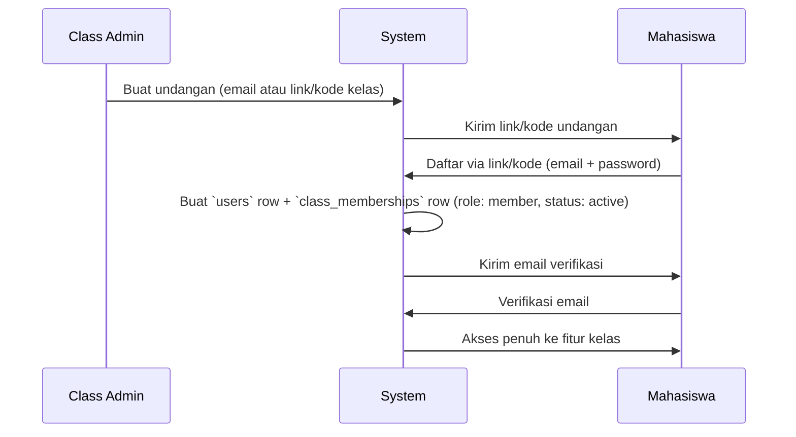

# 05 — Authentication

Status: ✅ Final untuk MVP.

## Pendekatan: Session-Based (Laravel Breeze)

Karena frontend adalah Blade + Livewire (bukan SPA terpisah), autentikasi memakai **session-based auth bawaan Laravel** lewat starter kit **Laravel Breeze**, bukan token-based (Sanctum/Passport). Ini konsisten dengan keputusan di [`02-architecture.md`](./02-architecture.md): satu stack, satu mental model, tanpa boundary API/frontend yang perlu dijaga terpisah.

| Kebutuhan | Solusi |
|---|---|
| Login/logout | Breeze default (session + CSRF protection bawaan Laravel) |
| Registrasi | Breeze default, **dimodifikasi**: registrasi tidak berdiri sendiri — lihat alur di bawah |
| Verifikasi email | Diaktifkan — email kampus/pribadi wajib diverifikasi sebelum akses fitur sosial (mengurangi akun palsu di lingkup kelas) |
| Reset password | Breeze default |
| Remember me | Aktif, sesuai kebiasaan pengguna web umum |

## Alur Registrasi — Terikat pada Undangan Kelas, Bukan Open Signup

Ini adalah keputusan disengaja: **registrasi tidak boleh terbuka bebas ke publik**. Produk ini adalah ruang privat satu kelas (prinsip *Privacy First* dan *Community Owned*), bukan platform publik.

**Mekanisme undangan (MVP, pilih yang paling sederhana untuk diimplementasi):** kode/link kelas yang dibuat Class Admin sekali di awal (mis. `dcu.app/join/TI6A-X92K`), bukan sistem undangan per-email satu-satu yang lebih kompleks. Undangan per-email individual bisa ditambahkan di P1 jika dibutuhkan.

Field tambahan untuk mendukung ini (lihat juga [`03-database.md`](./03-database.md)):

| Tabel | Kolom baru | Catatan |
|---|---|---|
| `classes` | `join_code` (string, unique) | kode undangan kelas |
| `classes` | `join_code_enabled` (boolean) | Class Admin bisa menonaktifkan sewaktu-waktu |

## Kenapa Bukan Sosial Login (Google/dsb.) di MVP

Dievaluasi tapi ditunda ke P2+: menambah kompleksitas OAuth config untuk manfaat yang belum kritikal di MVP satu kelas kecil. Bisa ditambahkan sebagai opsi tambahan (bukan pengganti) nanti tanpa mengubah struktur `users`.

## Kenapa Bukan Token-Based Auth (Sanctum) di MVP

Sanctum/Passport relevan **kalau** ada mobile app native atau SPA terpisah — yang menurut keputusan stack tidak ada di MVP. Namun karena `04-api.md` tetap didesain agar service layer bisa diekspos sebagai API di masa depan, menambahkan Sanctum nanti (untuk endpoint API tanpa mengganggu auth web yang sudah jalan) adalah perubahan aditif, bukan breaking — Laravel mendukung kombinasi session (web) + token (API) berdampingan secara native.

## Keamanan Dasar (MVP)

- Password hashing: bawaan Laravel (bcrypt)
- Rate limiting login: bawaan Laravel (`throttle` middleware) untuk mencegah brute-force
- CSRF protection: bawaan (semua form Blade/Livewire otomatis terlindungi)
- Verifikasi email wajib sebelum bisa posting/upload (mencegah akun spam)

Detail keamanan lebih luas (di luar auth) dibahas di [`10-security.md`](./10-security.md).

## Dampak ke Dokumen Lain

Dengan ini final, [`06-authorization.md`](./06-authorization.md) sudah bisa dikerjakan — menerjemahkan `class_memberships.role` menjadi Laravel Policy/Gate per fitur.
