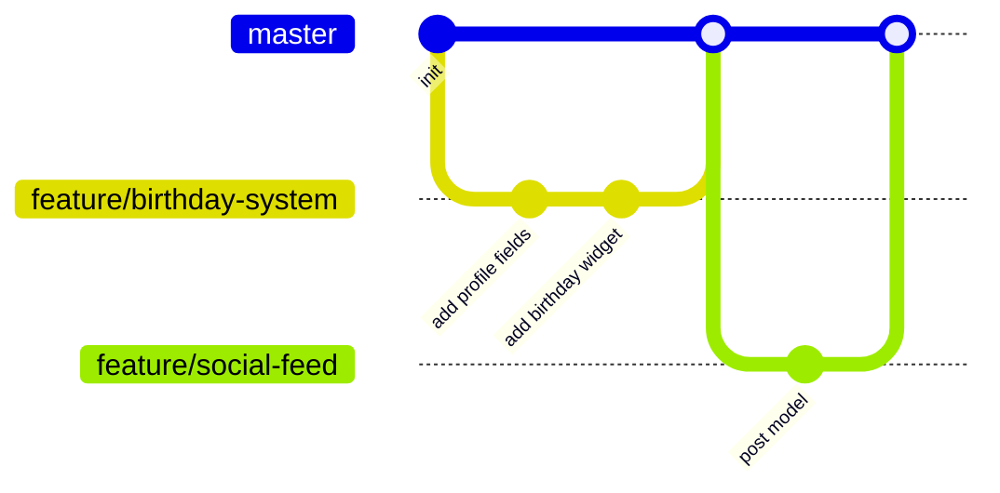

# 14 — Git Workflow

Status: ✅ Final.

## Branching Model: Trunk-Based Sederhana (bukan GitFlow penuh)

GitFlow (dengan `develop`, `release`, `hotfix` branch terpisah) dihindari — terlalu berat untuk tim mahasiswa kecil dan siklus rilis yang tidak formal. Dipakai model sederhana:

- **`master`** — selalu dalam kondisi bisa di-deploy. Tidak ada commit langsung ke `master`.
- **Feature branch** — satu branch per unit kerja (fitur, bugfix, dokumen), dibuat dari `master`, di-merge kembali via Pull Request.



## Konvensi Penamaan Branch

Format: `<type>/<deskripsi-singkat-kebab-case>`

| Type | Kapan dipakai |
|---|---|
| `feature/` | Fitur baru, mengacu ke file di [`07-features/`](./07-features/) |
| `fix/` | Perbaikan bug |
| `docs/` | Perubahan dokumentasi saja |
| `chore/` | Setup, dependency, config, tanpa perubahan perilaku |

Contoh: `feature/birthday-system`, `fix/poll-double-vote`, `docs/update-database-schema`

## Konvensi Commit Message

Mengikuti [Conventional Commits](https://www.conventionalcommits.org/) versi ringkas — cukup prefix, tanpa breaking-change footer yang jarang relevan di skala proyek ini:

```
feat: tambah widget birthday countdown di dashboard
fix: cegah user vote dua kali di polling yang sama
docs: update skema database untuk tabel achievements
chore: setup laravel breeze
```

## Pull Request

- **Wajib** sebelum merge ke `master` — tidak ada push langsung, meski untuk perubahan kecil (kebiasaan yang dijaga sejak awal lebih penting daripada kenyamanan sesaat).
- Minimal 1 reviewer dari anggota tim lain.
- Template PR (`.github/PULL_REQUEST_TEMPLATE.md`) wajib diisi, termasuk checklist dokumentasi terkait (prinsip *Documentation as Source of Truth*).
- CI (jika sudah ada — lihat [`12-testing.md`](./12-testing.md)) harus hijau sebelum merge.

## Menangani Konflik & Rebase

Tim mahasiswa umumnya belum terbiasa rebase — kebijakan: **merge commit diperbolehkan** (tidak wajib rebase/squash), prioritas adalah riwayat yang mudah dipahami, bukan riwayat linear sempurna. Squash merge boleh dipakai untuk PR kecil/berantakan commit-nya (opsional, keputusan reviewer).

## Tagging & Release

MVP tidak memakai semantic versioning formal (`v1.2.3`) di awal — cukup tag `mvp-launch` saat pertama kali dipakai kelas sungguhan. Versioning formal dipertimbangkan lagi jika proyek berkembang ke multi-kelas.
