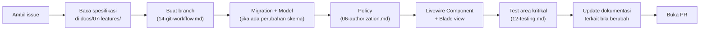

# 15 — Development Workflow

Status: ✅ Final.

## Setup Lokal (Ringkas)

1. Clone repo, `composer install`
2. Copy `.env.example` → `.env`, isi kredensial DB lokal
3. `php artisan key:generate`
4. `php artisan migrate --seed` (seeder menyediakan data dummy: 1 kelas contoh, beberapa member, beberapa post/event — supaya semua anggota tim tidak mulai dari database kosong yang membosankan untuk development fitur sosial)
5. `npm install && npm run dev` (Tailwind/Alpine build)
6. `php artisan serve`

Detail lengkap (requirements versi PHP/Node, dsb.) akan dipindahkan ke `README.md` root begitu `backend/` mulai berisi kode sungguhan — dokumen ini fokus pada **alur kerja**, bukan instalasi step-by-step yang akan terduplikasi dengan README.

## Siklus Kerja Harian

Urutan D→E→F bukan aturan kaku, tapi pola yang disarankan: bangun dari data model ke luar (model → aturan akses → tampilan), bukan mulai dari tampilan lalu menambal logic belakangan — lebih konsisten dengan prinsip *System Before Feature*.

## Kapan Harus Diskusi Dulu Sebelum Coding

- Perubahan skema database yang memengaruhi tabel yang sudah dipakai fitur lain
- Penambahan fitur yang belum tercatat di [`product/02-problem-solution-feature-mapping.md`](../product/02-problem-solution-feature-mapping.md)
- Perubahan permission matrix

Untuk hal-hal di atas, buat issue `discussion` dulu — jangan langsung buka PR besar yang berisiko ditolak setelah banyak kerja.

## Definition of Done

Sebuah task dianggap selesai jika:

- [ ] Kode berjalan sesuai user flow di spesifikasi fitur terkait
- [ ] Edge case yang tercatat di spesifikasi sudah ditangani
- [ ] Permission/visibility sudah benar (dicek manual dengan minimal 2 role berbeda: mis. Member dan Class Admin)
- [ ] Test area kritikal (jika relevan, lihat `12-testing.md`) ditambahkan
- [ ] Dokumentasi terkait diupdate dalam PR yang sama
- [ ] Direview & disetujui minimal 1 anggota tim lain
